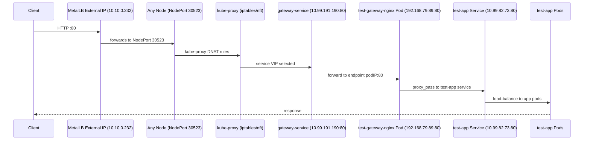
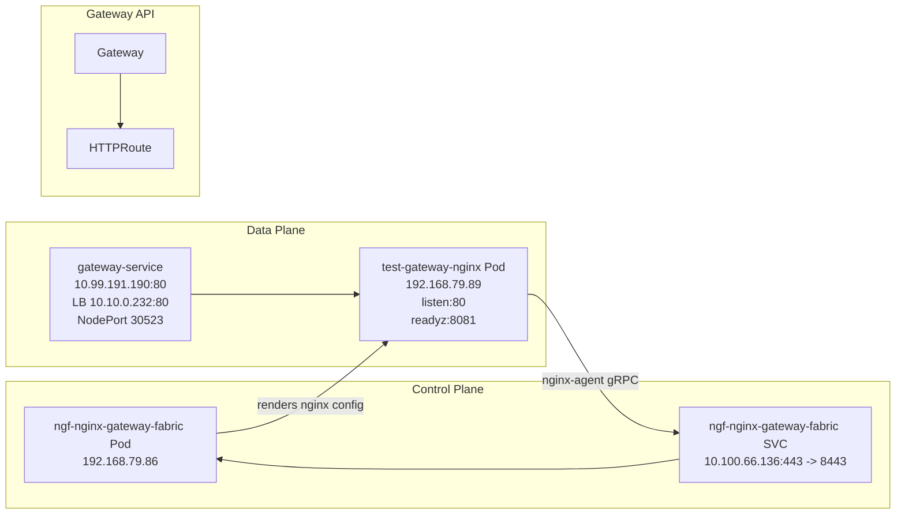

# NGINX Gateway Fabric + MetalLB Troubleshooting Notes (Full Chat Summary)

This README documents everything we did in this session to bring an **NGINX Gateway Fabric (NGF)** Gateway up on a **MetalLB LoadBalancer IP** and make it reachable via **NodePort / External IP**, plus why we sometimes got the wrong page (default nginx) depending on the **Host** header.

---

## 1) Environment (What we observed)

### Cluster nodes
- `k8s-master` : `10.10.0.200`
- `k8s-worker01`: `10.10.0.207`
- `k8s-worker02`: `10.10.0.204`

### MetalLB
- LoadBalancer service `gateway-service` in namespace `nginx-gateway`
- External IP allocated by MetalLB:
  - `gateway-service` external: `10.10.0.232`
  - MetalLB speaker was announcing from node `k8s-worker02` (layer2)

### Services
- `gateway-service` (LoadBalancer)
  - ClusterIP: `10.99.191.190`
  - External IP: `10.10.0.232`
  - NodePort: `30523`
- `test-app` (ClusterIP)
  - ClusterIP: `10.99.82.73:80`
  - Endpoints: `192.168.69.215:80`, `192.168.79.75:80`
- `ngf-nginx-gateway-fabric` (LoadBalancer / CP service)
  - ClusterIP: `10.100.66.136`
  - External IP: `10.10.0.231`

### Pods
- Control plane pod:
  - `ngf-nginx-gateway-fabric-...` running on `k8s-worker01` with Pod IP `192.168.79.86`
- Data plane pod (created by NGF per Gateway):
  - `test-gateway-nginx-...` running on `k8s-worker02` (later recreated)
  - initially showed `0/1` READY due to readiness failures

---

## 2) Initial Problem

### Symptoms
1. `gateway-service` had **no endpoints**:
   ```bash
   kubectl -n nginx-gateway get endpoints gateway-service -o wide
   # ENDPOINTS empty

2. `test-gateway-nginx` pod was **Running but not Ready**:

   * Readiness probe failed:

     * `http://<pod-ip>:8081/readyz` → `connect: connection refused`

3. Any curl to:

   * pod `:8080` failed
   * NodePort `:30523` failed
   * LB external ip `10.10.0.232:80` failed

4. NGINX inside the dataplane pod was **not listening** on expected port at first:

   * `netstat` showed it was only listening on `9113` (metrics) at one point.

---

## 3) Key Root Causes We Found

### Root cause A — Wrong Service targetPort for the dataplane

* The dataplane pod should serve HTTP on **port 80** (and readiness on **8081**).
* But `gateway-service` was pointing to `targetPort: 8080` (and also had an 8080/8081 confusion).
* Result:

  * Service had no working endpoint mapping
  * Traffic to NodePort / LB couldn’t reach the pod

### Root cause B — Control-plane service port mismatch (gRPC)

* Logs from dataplane showed nginx-agent trying to dial control plane:

  * `dial tcp 10.100.66.136:443: i/o timeout`
* The service `ngf-nginx-gateway-fabric` needed to point to the correct `targetPort` (we patched it to `8443`).

### Root cause C — “Wrong page” due to Host-based server selection

* NGINX config in dataplane created multiple `server {}` blocks:

  * `listen 80 default_server; return 404;`
  * a `server` that matches a specific hostname (when you set `spec.hostnames`)
  * a fallback regex `server_name ~^;` which can route differently
* Therefore:

  * Same IP can return **different content** depending on the HTTP `Host:` header.
  * When you hit the IP directly (`Host: 10.10.0.232`) you might match a different `server {}` than when you use (`Host: anything.local`).

---

## 4) What We Did (Step-by-step)

### 4.1 Validate LoadBalancer + NodePort mapping

We confirmed:

```bash
kubectl get svc -A -o wide | grep 30523
kubectl -n nginx-gateway describe svc gateway-service
```

We saw:

* NodePort `30523`
* External LB IP `10.10.0.232`

### 4.2 Confirm dataplane readiness failures

```bash
kubectl -n nginx-gateway describe pod test-gateway-nginx-... | egrep -i "Readiness|Unhealthy|Events"
kubectl -n nginx-gateway logs test-gateway-nginx-... --all-containers --tail=200
```

Readiness to `:8081/readyz` refused.

### 4.3 Inspect listening ports inside dataplane pod

Installed net-tools on the fly and checked:

```bash
kubectl -n nginx-gateway exec -it test-gateway-nginx-... -- sh -lc \
'netstat -lnt 2>/dev/null || (apk add --no-cache net-tools && netstat -lnt)'
```

Later we confirmed it listens on:

* `:80`
* `:8081`

### 4.4 Fix control-plane service port mapping

We patched the control-plane service:

```bash
kubectl -n nginx-gateway patch svc ngf-nginx-gateway-fabric --type='json' -p='[
  {
    "op": "replace",
    "path": "/spec/ports",
    "value": [
      {
        "name": "grpc",
        "port": 443,
        "targetPort": 8443,
        "protocol": "TCP"
      }
    ]
  }
]'
```

After patch:

```bash
kubectl -n nginx-gateway get endpoints ngf-nginx-gateway-fabric -o wide
# 192.168.79.86:8443
```

### 4.5 Recreate dataplane pod to re-init correctly

```bash
kubectl -n nginx-gateway delete pod test-gateway-nginx-...
kubectl -n nginx-gateway get pod -w
```

Now endpoints appeared:

```bash
kubectl -n nginx-gateway get endpoints gateway-service -o wide
# 192.168.79.89:8080,192.168.79.89:8080 (later fixed to :80)
```

### 4.6 Fix `gateway-service` targetPort to match dataplane (port 80)

We confirmed dataplane listens on 80:

```bash
kubectl -n nginx-gateway exec -it deploy/test-gateway-nginx -- sh -lc \
'netstat -lnt | egrep ":(80|8080|8081)\b"'
```

Then patched service targetPorts → **80**:

```bash
kubectl -n nginx-gateway patch svc gateway-service --type='json' -p='[
  {"op":"replace","path":"/spec/ports/0/targetPort","value":80},
  {"op":"replace","path":"/spec/ports/1/targetPort","value":80}
]'
```

Now endpoints became:

```bash
kubectl -n nginx-gateway get ep gateway-service -o wide
# 192.168.79.89:80,192.168.79.89:80
```

### 4.7 Verify reachability (internal + external)

ClusterIP:

```bash
curl -v http://10.99.191.190:80/
```

NodePort:

```bash
curl -v http://10.10.0.204:30523/
```

MetalLB External:

```bash
curl -v http://10.10.0.232:80/
```

All returned HTTP 200.

---

## 5) Gateway API Objects (What exists)

### Gateway

* `test-gateway` (namespace `nginx-gateway`)
* Listener:

  * `HTTP` port `80`
* Status:

  * `Accepted=True`
  * `Programmed=True`

### HTTPRoute(s)

We had two routes at some point (`app-route`, `main-route`) and removed `main-route`.
Finally we applied one clean route:

```yaml
apiVersion: gateway.networking.k8s.io/v1
kind: HTTPRoute
metadata:
  name: app-route
  namespace: nginx-gateway
spec:
  parentRefs:
  - name: test-gateway
  rules:
  - matches:
    - path:
        type: PathPrefix
        value: /
    backendRefs:
    - name: test-app
      port: 80
```

---

## 6) Why “it works but not all URL” happened

### Case 1 — Different pages for different Host headers

You saw:

* `Host: 10.10.0.232` → returns your **Test App** page
* `Host: anything.local` → returns the **default nginx welcome page** (sometimes)
* Some paths like `/foo` or `/healthz` returned `404`

This is normal if the backend itself doesn’t serve those paths, OR if the request is landing in a different `server {}` block due to `Host` matching.

### Case 2 — Your backend returns 404 for unknown paths

We tested backend directly:

```bash
curl http://test-app.nginx-gateway.svc.cluster.local/foo
# 404 from nginx/1.29.4
```

So `/foo` returning 404 is expected if your app only serves `/`.

### Case 3 — NGINX “default_server” can hijack requests

From `nginx -T`, we saw a server like:

* `listen 80 default_server; return 404;`
  and additional `server` blocks for hostnames / fallback.

So hitting the LB by IP can match something different than your intended route unless hostnames are configured consistently.

---

## 7) How to Make It Always Route “for any host”

Pick **one** approach:

### Option A (recommended): Use a fixed hostname and always send it

Set route hostname:

```bash
kubectl -n nginx-gateway patch httproute app-route --type='merge' -p '{
  "spec": { "hostnames": ["app.local"] }
}'
```

Then test:

```bash
curl -v http://10.10.0.232/ -H 'Host: app.local'
```

### Option B: No hostnames (match all)

If you remove `spec.hostnames`, it should match all hosts, but NGINX server selection can still differ depending on how the controller generates config.
If you want “always same behavior”, hostnames are usually cleaner.

---

## 8) Quick Verification Checklist (Commands)

### A) Service endpoints are correct

```bash
kubectl -n nginx-gateway get ep gateway-service -o wide
kubectl -n nginx-gateway get svc gateway-service -o wide
```

Expected:

* Endpoints point to podIP **:80**

### B) Pod listens on port 80

```bash
kubectl -n nginx-gateway exec -it deploy/test-gateway-nginx -- sh -lc \
'netstat -lnt | egrep ":(80|8081)\b"'
```

Expected:

* LISTEN on `:80` and `:8081`

### C) NGINX config shows server blocks

```bash
kubectl -n nginx-gateway exec -it deploy/test-gateway-nginx -- sh -lc \
"nginx -T 2>/dev/null | egrep -n 'listen 80|server_name|default_server|proxy_pass' | head -120"
```

### D) End-to-end tests

```bash
curl -v http://10.10.0.232/
curl -v http://10.10.0.232/ -H 'Host: app.local'
curl -v http://10.10.0.204:30523/
```

---

## 9) Cluster Topology Diagrams

### 9.1 Internal Cluster Topology

```mermaid
flowchart TB
  subgraph Cluster[Kubernetes Cluster]
    direction TB

    subgraph Nodes[Nodes]
      direction LR
      M[k8s-master\n10.10.0.200]
      W1[k8s-worker01\n10.10.0.207]
      W2[k8s-worker02\n10.10.0.204]
    end

    subgraph PodNet[Pod Network (CNI)\n192.168.x.x]
      direction LR
      DP[test-gateway-nginx Pod\n192.168.79.89\nlistens:80\nreadyz:8081]
      APP1[test-app Pod\n192.168.69.215:80]
      APP2[test-app Pod\n192.168.79.75:80]
      CP[ngf-nginx-gateway-fabric Pod\n192.168.79.86\ngrpc:8443]
    end

    subgraph Services[Services]
      direction TB
      GW_SVC[gateway-service\nClusterIP 10.99.191.190:80\nLB 10.10.0.232:80\nNodePort 30523]
      APP_SVC[test-app\nClusterIP 10.99.82.73:80]
      CP_SVC[ngf-nginx-gateway-fabric\nClusterIP 10.100.66.136:443\n-> targetPort 8443]
    end

    subgraph GatewayAPI[Gateway API]
      direction TB
      GW[Gateway test-gateway\nlistener:80]
      HR[HTTPRoute app-route\nPathPrefix / -> test-app:80]
    end
  end

  GW --> HR
  HR --> APP_SVC
  APP_SVC --> APP1
  APP_SVC --> APP2

  GW_SVC --> DP
  DP -->|proxy_pass| APP_SVC

  DP -->|nginx-agent gRPC| CP_SVC
  CP_SVC --> CP
```

---

### 9.2 Request Flow (Client -> LB -> NodePort -> Service -> Pod -> Backend)



---

### 9.3 Control Plane vs Data Plane (NGF)



---

## 10) Final Status

✅ `gateway-service` endpoints are correct (`podIP:80`)
✅ External LB (`10.10.0.232:80`) responds
✅ NodePort (`30523`) responds
⚠️ Different responses may occur based on `Host:` header and your backend routes
⚠️ `/healthz` is not implemented as a public path in your app; it returns 404 (expected unless you implement it)

---

## 11) Next Improvements (Optional)

1. **Standardize hostname**:

   * Use `app.local` (or a real DNS name) and always send it.
2. **Add health route**:

   * Either expose `/readyz` safely or create a dedicated health HTTPRoute to a health backend.
3. **Ensure single route**:

   * Avoid multiple overlapping HTTPRoutes unless intended.

---

````

If you want, paste your current:
```bash
kubectl -n nginx-gateway get svc gateway-service -o yaml
kubectl -n nginx-gateway get httproute app-route -o yaml
````

